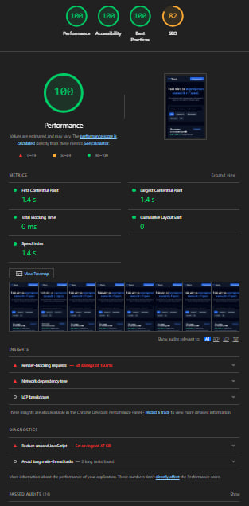

# React + TypeScript + Vite

Про проєкт:
VV Work платформа для пошуку роботи та працівників у Європі, що з'єднує кандидатів і роботодавців. Цей репозиторій, реалізація тестового завдання на позицію Frontend Developer: три сторінки платформи (Головна, сторінка роботодавця, Контакти) зі спільними Header/Footer, спроєктовані й зверстані самостійно в коді, без готового Figma-макета.
Стек:
Vite, збірка проєкту
React + TypeScript (strict mode)
Tailwind CSS, стилізація, без сторонніх UI-кітів
React Router (react-router-dom) маршрутизація
Керування станом, локальний useState/useMemo та кастомні хуки, без Redux/Zustand
Акцентний колір, синій (blue-600/blue-500), нейтральна палітра slate

Запуск проєкту
Встановлення залежностей
bash
git clone <https://github.com/kostantinovercuk39-ship-it/test>
cd vv-work
npm install

Режим розробки
bash
npm run dev

Застосунок буде доступний за адресою http://localhost:4173/

Продакшн-білд
bash
npm run build
npm run preview

Тести
bash
npm run test
npm run test:coverage

Структура проєкту
src/
├── components/
│   ├── Header.tsx             # Верхня навігація, спільна для всіх сторінок
│   └── Footer.tsx              # Підвал із контактами та модалкою політики
├── hooks/
│   ├── useDebounce.ts         # Кастомний хук ручного debounce (без бібліотек)
│   └── useDebounce.test.ts    # Юніт-тести хука debounce
├── pages/
│   ├── Home.tsx                # Головна сторінка (/)
│   ├── PartnerPage.tsx         # Сторінка роботодавця (/partners/:slug)
│   ├── PartnerPage.test.tsx   # Юніт-тести сторінки роботодавця
│   ├── Contacts.tsx            # Сторінка контактів / форма заявки (/contacts)
│   └── Contacts.test.tsx      # Юніт-тести форми заявки
├── services/
│   ├── mockApi.ts              # Мокова fetch-обгортка, що імітує реальний API
│   └── mockApi.test.ts        # Юніт-тести мокового API
├── types.ts                    # Спільні типи (Job, ApplicationFormData, Category)
├── App.tsx                     # Роутинг і layout (Header + сторінка + Footer)
└── main.tsx                     # Точка входу застосунку

Маршрутизація:
/
Home
Hero-блок, пошук і фільтрація вакансій

/partners/:slug
PartnerPage
Сторінка для роботодавців

/contacts
Contacts
Форма заявки і зв'язку

Header і Footer підключені один раз на рівні layout і перевикористовуються на кожній сторінці.
Огляд компонентів і сторінок
Header
Sticky-хедер із логотипом VV Work, навігацією (Головна, Роботодавець, Контакти) через NavLink з підсвіткою активного пункту та кнопкою-CTA «Знайти працівника».
Footer
Підвал із логотипом, копірайтом, контактами (Telegram, телефон, email) і кнопкою, що відкриває нижню висувну панель (bottom drawer) з текстом політики конфіденційності/умов використання, об'єднано в один пункт замість кількох окремих посилань.
Home (/)
Hero-блок із ціннісною пропозицією платформи
Пошук вакансій за назвою/локацією/описом із ручним debounce (useDebounce, 300мс, без бібліотек)
Фільтр за категорією (кнопки-чипи: Усі, Будівництво, Виробництво, Логістика, IT)
Список фільтрується через useMemo, що перераховує результат лише при зміні дебаунсеного пошуку або обраних категорій
Пагінація «Показати ще» (по 10 карток за раз) замість нескінченного скролу
Лічильник «Показано X із Y вакансій» і пустий стан, коли нічого не знайдено
PartnerPage (/partners/:slug)
Сторінка для роботодавців: пояснення переваг співпраці з VV Work (швидкий підбір, перевірені кадри, супровід) і CTA «Знайти працівника», що веде на сторінку контактів.
Contacts (/contacts)
Форма заявки з полями «Ім'я» та «Телефон/Telegram», інлайн-валідацією без alert(), станами idle / submitting / success / error та сабмітом через мокову submitApplication.

useDebounce
Універсальний хук useDebounce<T>(value, delay = 300), що відкладає оновлення значення на вказаний час, використовується для пошуку вакансій, щоб не перераховувати список на кожне натискання клавіші.

mockApi
Сервісний шар, що імітує мережеві запити (fetchJobsByPartner, submitApplication) зі штучною затримкою відповіді через функцію delay(), симулюючи роботу реального бекенду.

Валідація форми заявки

Клієнтська валідація без сторонніх бібліотек:
«Ім'я» - обов'язкове поле
«Телефон/Telegram» - обов'язкове поле, мінімум 3 символи
Помилки виводяться інлайн під формою, без alert()
Під час відправки кнопка блокується і показує стан «Надсилання...»
Успіх або помилка сервера виводяться окремими повідомленнями під формою

Адаптивність
Верстка mobile-first на основі брейкпоінтів Tailwind: базові стилі розраховані на мобільні екрани, sm:/md: використовуються для перебудови навігації, сітки карток вакансій і компонування форми на планшетах і десктопі.

Тестування
Стек: Vitest + React Testing Library, покриття рахується через @vitest/coverage-v8.

bash
npm run test
npm run test:coverage

Результат прогону: 4 test-файли, 12 тестів, усі пройдено (Test Files 4 passed, Tests 12 passed, ~3.16с).
Тестові файли:
src/hooks/useDebounce.test.ts (3 тести) - логіка ручного debounce, значення оновлюється лише після завершення затримки
src/pages/PartnerPage.test.tsx (2 тести) - рендер заголовка й переваг співпраці, наявність посилання «Знайти працівника», що веде на /contacts
src/pages/Contacts.test.tsx (4 тести) - інлайн-валідація форми (порожнє ім'я, порожній контакт, надто короткий контакт) та успішний сабміт при валідних даних
src/services/mockApi.test.ts (3 тести) - фільтрація вакансій за partnerSlug, успішний submitApplication, відхилення запиту без обов'язкових полів

Покриття коду (v8):
Усі файли: 97.91% stmts, 94.73% branch, 93.75% funcs, 97.67% lines
hooks/useDebounce.ts: 100% за всіма показниками
pages/Contacts.tsx: 96.15% stmts, 92.85% branch, 83.33% funcs, 96.15% lines, непокритий рядок 39
pages/PartnerPage.tsx: 100% за всіма показниками
services/mockApi.ts: 100% за всіма показниками
Загальне покриття (98%) перевищує мінімальну вимогу брифу (60%).

Lighthouse
Результат перевірки продуктивності в Google Lighthouse:

Performance: 100
Accessibility: 100
Best Practices: 100
SEO: 82

Мої рішення:
Структура Головної сторінки. Пошук і список вакансій розміщені одразу під Hero-блоком, щоб користувач бачив реальні пропозиції одразу, без переходу на окрему сторінку. Швидший пошук вакансії. Поле пошуку і фільтр за категорією працюють одночасно та одразу оновлюють лічильник «Показано X із Y», а пагінація «Показати ще» не перевантажує сторінку зайвим контентом. Стейт-менеджмент без Redux/Zustand. Для трьох незалежних сторінок без спільного глобального стану достатньо локального useState і кастомних хуків, це простіше і легше за підключення стору заради невеликого обсягу стану. Боротьба із зайвими ре-рендерами. Фільтрація списку винесена в useMemo і залежить від дебаунсеного значення пошуку, а не від «сирого», важкий перерахунок списку відбувається лише після паузи в наборі тексту, а не на кожне натискання клавіші. Що змінено відносно брифу. Блок «Потрібні працівники?» винесено в окрему сторінку роботодавця (/partners/:slug) замість короткого блоку на Головній, тема достатньо об'ємна (переваги співпраці, процес, CTA), щоб не перевантажувати Головну і залишити на ній фокус на пошуку вакансій.
Відхилення від наданого брифу:
Футер об'єднує «Політику конфіденційності» та «Умови використання» в один пункт із висувною панеллю, а не в окремі посилання, компактніше для етапу MVP.